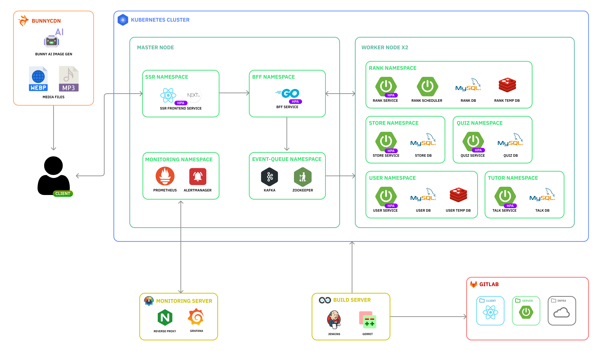

# 도란도란

---

## 목차

---

1. [프로젝트 개요](#프로젝트-개요)
2. [서비스 소개](#서비스-소개)
3. [동작 영상](#동작-영상)
4. [기술 스택](#기술-스택)
5. [아키텍쳐 구조도](#아키텍쳐-구조도)
6. [개발 환경](#개발-환경)
7. [팀원 및 역할](#팀원-및-역할)
8. [아키텍쳐 구조도](#아키텍쳐-구조도)

## 프로젝트 개요

---

외국인을 위한 한국어 학습 애플리케이션

- 프로젝트 노션 : [Notion](https://daftenp.notion.site/SSAFY-11-E102-4566a5414e52444393a44e6b64139708?pvs=4)
- 프로젝트 기간 : 2024-08-19 ~ 24.10.11

## 서비스 소개

---

### 주요 기능

- AI 기반의 튜터와 함께 학습하며, 맞춤형 학습 가이드를 제공받을 수 있습니다. 학습 진행 상황에 따라 개인별 피드백을 실시간으로 제공합니다.

- AI가 생성한 이미지를 활용한 학습 콘텐츠를 제공합니다. 3가지 유형의 퀴즈를 통해 재미있고 효과적인 학습을 할 수 있습니다.

- 상점에서 다양한 아이템을 구매하여 캐릭터를 커스터마이징할 수 있습니다. 옷장 기능을 통해 획득한 아이템을 자유롭게 관리하고 적용할 수 있습니다.

- 학습 활동을 통해 다양한 재화를 획득하고, 경험치를 쌓아 캐릭터를 성장시킬 수 있습니다. 재화를 통해 학습의 동기부여를 높이고, 다양한 보상을 제공합니다.

- 학습 성과에 따라 사용자 간 랭킹을 확인할 수 있습니다. 자신의 랭킹을 올리기 위해 더욱 적극적인 학습을 유도합니다.

- 사용자의 학습 수준에 따라 티어가 설정됩니다. 상위 티어로 올라갈수록 더 많은 혜택과 도전 과제가 제공됩니다.

### 특징

- **개인 맞춤형 학습**  
  AI 기반 튜터가 학습자의 수준에 맞춘 맞춤형 학습 가이드와 실시간 피드백을 제공해 학습 효율성을 높입니다.

- **학습 동기부여**  
  재화와 경험치 시스템, 캐릭터 커스터마이징 등으로 학습자들이 더 적극적으로 학습에 참여하게 하고, 성취감을 느낄 수 있습니다.

- **경쟁을 통한 성취감 강화**  
  랭킹 시스템과 티어 제도로 학습자들이 경쟁하며 학습 성과를 높이고, 더 많은 혜택과 도전 과제를 통해 지속적인 동기부여를 얻을 수 있습니다.

## 동작 영상

---

|            AI tutor            |           상점            |
|:------------------------------:|:-----------------------:|
|  |    |
|             마이페이지              |           랭킹            |
|      |  |
|               학습               |           퀴즈            |
|           |    |

움짤 추가 예정

## 기술 스택

---

### - Backend

 
   
  
  
  
      
        
           
            

### - Frontend

   
     
  
  
   
     
        

### - Infrastructure

  
  
  
    

### - ETC

       
   
      

## 아키텍쳐 구조도

---

## 개발 환경

---

### BE

- Java 17
- Spring Boot 3.3.4
- MySQL 8.0
- Redis 6.2
- Kafka
- Spring Security (User Service)
- Spring Batch (Rank Service)
- Spring Data JPA
- Spring AI

### FE

- HTML5/CSS3/JavaScript
- React 18
- Next.js 14
- Redux Toolkit
- Tailwind CSS

### Infra

- Google Cloud Platform
- BunnyCDN
- Docker
- Kubernetes
- Jenkins
- Go

### Collaboration

- GitLab
- Gerrit
- Jira

## 팀원 및 역할

---

<table>
    <tr>
        <td align="center"><a href="https://github.com/DaftenP">박지용</a></td>
        <td align="center"><a href="https://github.com/picel">김상범</a></td>
        <td align="center"><a href="https://github.com/hsusj996">김세진</a></td>
        <td align="center"><a href="https://github.com/dbdbais">이강우</a></td>
        <td align="center"><a href="https://github.com/everev1">김지환</a></td>
        <td align="center"><a href="https://github.com/there2989">노재훈</a></td>
        <td align="center"><a href="https://github.com/kdhn97">김동현</a></td>
    </tr>
    <tr>
        <td align="center"><a href="https://github.com/DaftenP"></a></td>
        <td align="center"><a href="https://github.com/picel"></a></td>
        <td align="center"><a href="https://github.com/hsusj996"></a></td>
        <td align="center"><a href="https://github.com/dbdbais"></a></td>
        <td align="center"><a href="https://github.com/everev1"></a></td>
        <td align="center"><a href="https://github.com/there2989"></a></td>
        <td align="center"><a href="https://github.com/kdhn97"></a></td>
    </tr>
    <tr>
        <td align="center"><b>PM, Backend</b></td>
        <td align="center"><b>Infra, Backend</b></td>
        <td align="center"><b>Backend</b></td>
        <td align="center"><b>Backend</b></td>
        <td align="center"><b>Frontend</b></td>
        <td align="center"><b>Frontend</b></td>
        <td align="center"><b>Frontend</b></td>
    </tr>
</table>

### 역할 분담

- **Backend**
    - 박지용
        - 프로젝트 관리 및 기획 총괄
        - Quiz Micro Service 구현 (Spring Boot)
        - 퀴즈 컨텐츠 설계 및 제작
        - whisper model fine-tuning

    - 김상범
        - Gerrit / Jenkins 설정, CI/CD 파이프라인 설계/구축/관리
        - Gerrit 가이드 문서 작성, clone/push 자동화 스크립트 개발, 개발자 교육, 이슈 대응
        - Kubernetes 클러스터 구축 (1 Master, 2 Worker)
        - BunnyCDN AI 이미지 생성 도구 자동화
        - Go 언어로 BFF 작성
        - Prometheus/Grafana 모니터링 시스템 구축
        - 포팅 스크립트 (bash shell) 작성

    - 김세진
        - AI tutor Micro Service 구현 (Spring Boot)
        - Ranking Mircro Service 구현 (Spring Boot)
        - Spring AI 기반 LLM 기능 개발
        - 리그 시스템 설계 및 배치 스케줄러 구현 (Spring Boot)

    - 이강우
      - JWT 토큰과 Redis를 이용한 회원가입, 로그인 인증 구현 (Spring Boot)
      - 상점 기능, 아이템 착용 기능 및 로그 구현 (Spring Boot)
      - Kafka Consumer, Producer를 통한 데이터 일관성 유지 (Spring Boot)
      - 데일리 미션 및 스케줄러 구현 (Spring Boot)
      - SMTP 이용한 이메일 인증 구현 (Spring Boot)

- **Frontend**
    - 노재훈
        - next-intl을 활용한 다국어 웹사이트 구현
        - Redux toolkit 구조 도입
        - JWT 토큰 인증 구현
        - UX/UI 작업 및 목업 제작
        - 프로젝트 로고 제작
        - 메인 페이지, 상점 페이지 제작
        - AI Tutor 서비스 구현

    - 김동현
        - Next PWA 설정
        - 로그인, 회원가입 구현
        - 프로필 페이지 구현
        - 옷장 페이지 구현

    - 김지환
        - 랭킹 페이지 구현
        - 학습 페이지 구현
        - 퀴즈 페이지 구현
        - 상점 페이지 디자인
        - 퀴즈 정답 처리(POST 요청, 로컬 저장소)	

    