# 시연 시나리오

S : 도란도란 서비스 시연을 시작하겠습니다.

# # 로그인 페이지

1. 도란도란 캐릭터 간단 소개
2. 미리 입력되어 있는 아이디, 비밀번호로 로그인

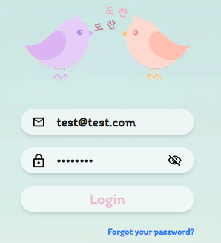

예시 이미지

# # 메인 페이지

S: 도란도란의 메인페이지는 귀여운 UI와 사용자의 학습을 도와줄 캐릭터 구성됩니다.

1. 메인 화면 간단 소개
   1. 상단바 간단 소개
   2. 주간 진행도 간단 소개
   3. 하단바 간단 소개

S: 이제 오늘의 퀴즈를 풀러 가보겠습니다. 진행상태를 보니 5문제가 풀어져 있네요. 나머지를 한번 풀어보겠습니다. 오늘의 주제는 동물이라고 도련이 친절하게 알려주네요. 화면의 보이는 Play를 눌러보겠습니다.

# # 퀴즈 페이지

S: 데일리 퀴즈는 기초 단어, 문장, 표현에 대해 여러가지 유형을 제공

S: 그럼 시연자가 이어서 문제를 풀어보겠습니다.

S: 퀴즈는 회화 중심으로 설계했기 때문에 크게 듣기와 말하기 유형으로 구성

S: 모든 퀴즈 이미지는 생성형 AI를 활용해 구성함

S: 말하기 유형의 경우 STT 기술을 활용해 텍스트로 변환하고 정답을 판단함

S: 퀴즈의 난이도는 사용자의 학습 진행정도로 결정됨

유형별로 설명하기

1. 따라 말하기

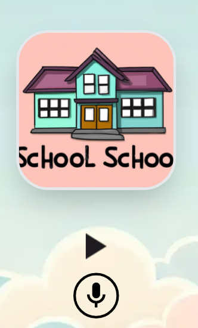

1. 제시어 맞추기

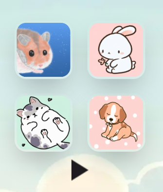

1. 문장 말하기

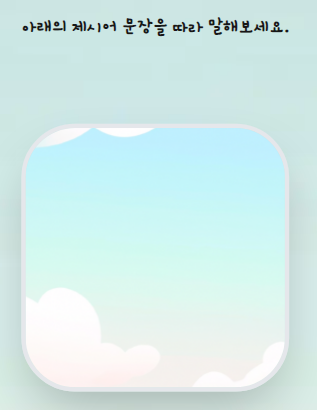

유형은 추가 가능

퀴즈 유형 모두 설명 후

S: 퀴즈를 모두 풀고 메인 페이지로 돌아오겠습니다.

# # 메인페이지

(일일 진행도, 주간 진행도가 채워진 것을 보며)

S: 이렇게 퀴즈를 모두 풀면 진행도가 채워지며 XP를 획득합니다.

S: 만일 사용자가 추가적으로 학습하고 싶다면 학습 페이지에서 퀴즈를 풀 수 있습니다.

# # 학습 페이지

S: 학습 페이지에서는 이런식으로 Stage별로 퀴즈를 제공하고 있습니다.

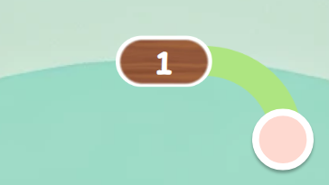

S: 첫번째 스테이지를 클릭해보겠습니다.

S: 아까 풀었던 비슷한 퀴즈 유형이 있는데요. 사용자가 학습 페이지에서 퀴즈를 풀고 스테이지를 진행시킨다면 이를 반영하여 일일 퀴즈 난이도도 함께 상승하게 됩니다.

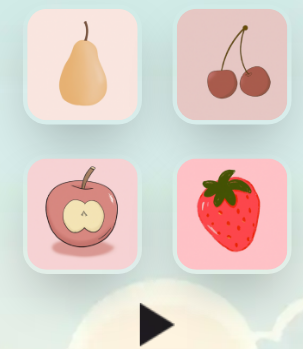

S: 학습 페이지는 풀지 않고 넘어가도록 하겠습니다.

# # 메인 페이지

S: 다음으로는 AI 회화 선생님 기능으로 가보겠습니다.

# # AI Tutor 페이지

(이전 대화 선택 모달창을 보며)

S: 저희는 이전 대화를 이어가지 않고 새로운 대화를 생성해보겠습니다.

### #1. 역할 선택

S: AI 역할은 친구, 식당 직원, 택시 기사, 의사, 면접관까지 다양하게 구성해놓았습니다.

S: 식당 직원으로 선택해보겠습니다.

### #2. 상황 선택

S: 다음으로는 상황을 선택해보겠습니다. 많은 상황이 있지만 저희는 메뉴를 추천받는 상황을 선택해보겠습니다.

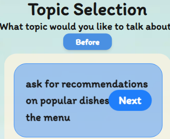

### #3. 대화 화면

S: 대화가 시작되면 AI 선생님이 먼저 상황극을 시작합니다.

S: TTS를 활용하여 대화 문장을 반복해서 들을 수 있고 사용자 언어에 맞는 번역과 대답에 대한 힌트를 확인할 수 있습니다

(재생, 번역, 힌트 차례로 보여주기)

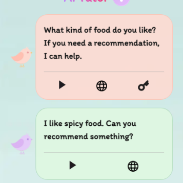

S: 한번 힌트를 보고 시연자분이 적절하게 대답을 해보겠습니다.

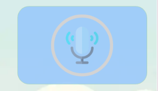

S: 사용자가 적절하게 대답하면 AI 선생님이 대화의 적절성과 발음을 평가해줍니다.

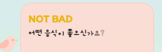

S: 대화를 이어감

(계속 대화를 이어감)

S: 만일 사용자가 욕설이나 관련 없는 내용을 하면 즉시 대화를 종료하게끔 설계했습니다.

(시연자 욕설이나 관련없는 내용 말하기)

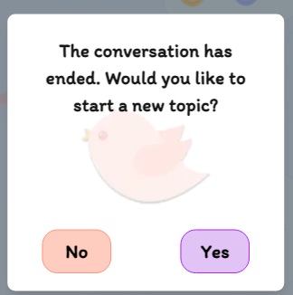

S: 그럼 AI 선생님과의 대화를 끝마치고 메인으로 돌아오겠습니다.

# # 메인 페이지

S: 이번에는 리그 및 랭킹 페이지로 가보겠습니다.

(랭킹 페이지 이동)

# # 랭킹 페이지

### #1. 리그 페이지

S: 도란도란은 사용자의 학습 흥미를 위해 리그 기능을 개발했습니다.

S: 사용자는 매 주 새로운 리그에 배치되어 다른 사람들과 랭크 경쟁을 합니다.

S: 퀴즈나 AI 선생님과의 대화를 통해 XP를 획득하여 순위를 올릴 수 있고 매주 일요일 리그 결산에 의해서 랭크 승강이 이루어집니다.

S: 다음으로는 전체 랭킹 페이지를 보겠습니다.

### #2. 전체 랭킹 페이지

S: 랭킹 페이지는 전체 사용자의 순위를 알 수 있습니다.

S: 한 주간 획득 경험치를 기준으로 순위가 정해지며 전 주, 금 주의 랭킹과 현재 사용자의 랭킹을 확인할 수 있습니다.

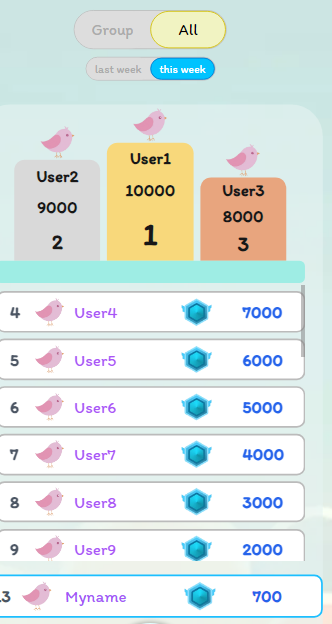

S: 다음은 상점 페이지로 가보겠습니다.

# # 상점 페이지

S: 상점 페이지에서는 캐릭터를 꾸밀 수 있는 다양한 아이템을 구매할 수 있습니다.

S: 랜덤 장비를 구매해보겠습니다.

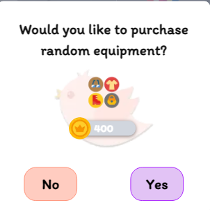

S: 구매가 됐으니 바로 장착해보겠습니다.

### #1. 옷장

S: ~ 모자를 획득했네요. 한번 장착해보겠습니다.

S: 이렇게 색이나 모자, 배경화면 같이 다양하게 꾸밀 수 있는 요소가 있습니다.

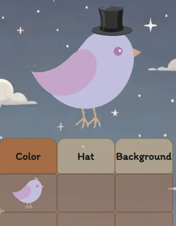

S: 다시 메인페이지로 돌아오겠습니다.

# #메인 페이지

S: 이상으로 시연 마치겠습니다.
